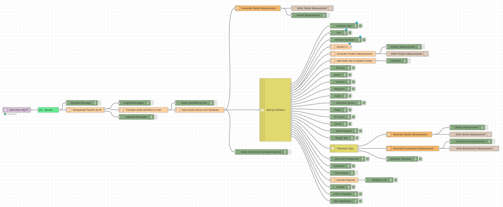

# meshtastic-node-red
Node-RED Configuration for Meshtastic Packets

## Features
- Ingestion from MQTT
- Protobufs decoding
- Message deduplication by ID
- Translating integer To/From node ids to hex
- Annotating packets with known NodeInfo
- Split for all current port numbers
- Writing Packet, Device, Environment and Position measurements to InfluxDB
- Debug nodes for all outputs

## Flow Preview

## Known Limitations
- NeighbourInfo payloads are not correctly decoded
